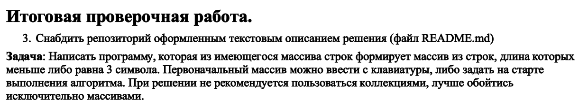

## Краткое описание.
Код программы позволяет задать числовой размер **массива 1** и произвести ввод строковых элементов массива. По окончании ввода будет выведен **массив 2**, в который включены все элементы **массива 1** длина которых меньше или равна 3 символа.

## 1. Описание методов.

1.1. Метод FillArray - позволяет заполнить массив элементами.
Каджый *i* элемент **массива 1** от 0 до его последнего элемента заполняется пользователем вводом с клавиатуры.

1.2. Метод PrintArray - выводит в консоль элементы массива.
Каджый *i* элемент **массива** отправленного для обработки в PrintArray, от 0 до его последнего элемента выводится на экран.

1.3. Метод SearchStr - Заполнение массива 2

1.3.1 Определяем длину массива 2
Каджый *i* элемент **массива 1** от 0 до его последнего элемента проверяется на соответствие условию длины: "меньше или равно 3 символа". Если условие выполняется, то счетчик count увеличивается на единицу.
После выполнения цикла длине массива 2 присваивается значение count.

1.3.2. перебор и поиск элементов массива с количеством символов <=3.
Каджый *j* элемент **массива 1** от 0 до его последнего элемента проверяется на соответствие условию длины: "меньше или равно 3 символа". Если условие выполняется, то значению *k* элемента **массива 2** присваивается значение *j* элемента **массива 1**, а счетчик *k* увеличивается на 1 для подготовки записи следующего элемента в **массива 2**.
После выполнения цикла функция возвращает значение ArrayResult - заполненный **массив 2**.

## 2. Описание алгоритма.

2.1. При запуске программы после сообщения "Введите размер массива 1:" - вводим цифровое значение и тем самым задаем размер **массива 1**.
2.2. Вызывается метод FillArray в который мы передаем массива arrayStart c заданным размером. Работа FillArray описана в п.1.1.
2.3. Вызывается метод PrintArray в который мы передаем массива arrayStart. Работа PrintArray описана в п.1.2.

2.4. Массиву ArrayResult (**массив 2**) присваивается значение **массив 1** с применением метода SearchStr. Работа SearchStr описана в п.1.3.
2.5. Далее, при помощи PrintArray (п.1.2.) выводим на экран **массив 2** предаврительно установив другой цвет для текста. После вывода массива цвет текста переводится в состояние "по умолчанию".

4. Оператор try-catch - обработчик для определения ошибок ввода
